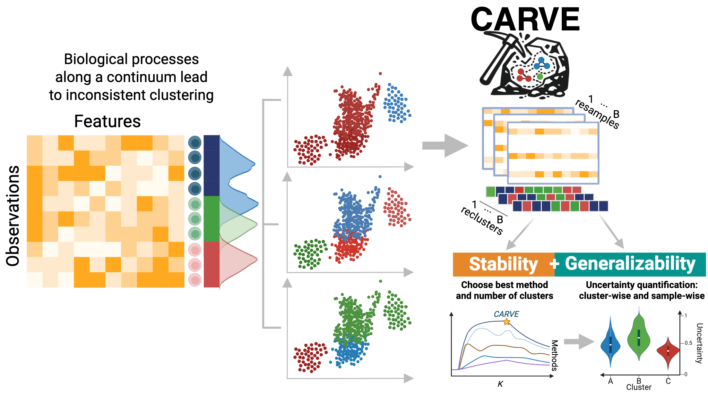

[](https://github.com/DataSlingers/CARVE/actions/workflows/ci.yml)
[](https://github.com/DataSlingers/CARVE/actions/workflows/r-ci.yml)
[](https://codecov.io/gh/DataSlingers/CARVE)


# CARVE

**Cluster Analysis with Resampling for Validation and Exploration**

Choosing the number of clusters is hard, especially for high-dimensional biological data where standard internal clustering validation indices (CVIs) are often unreliable. CARVE measures clustering robustness through two resampling-based concepts: **stability** (reproducibility of cluster assignments under data perturbation) and **generalizability** (agreement between held-out clusterings and predictions from a classifier trained on the clustering). It reports global, cluster-level, and sample-level diagnostics with visualizations, all through a scikit-learn-compatible API.

<p align="center">
  
</p>

## Features

- Scikit-learn-compatible API: `CARVE` extends `BaseEstimator` with a `fit` / `get_labels` / `get_k` workflow
- Stability (intra-subsample ARI) and generalizability (held-out prediction accuracy) metrics
- Diagnostics at the global, per-cluster, and per-sample level
- Metrics: ARI, consensus PAC, Gini, cross-entropy, and predictive accuracy
- Selection rules: `max`, `1se` (one-standard-error), and `quantile`
- Custom spectral clustering with self-tuning affinity (based on <TODO – citation>)
- Preprocessing: normalization (identity, StandardScaler, log1p) and dimensionality reduction (identity, PCA, t-SNE, UMAP), optionally randomized per resample
- Plots: metric-over-*k* curves, consensus heatmaps, box plots, violin plots, and scatter plots
- Parallel resampling via joblib (`n_jobs`)

## Installation

CARVE requires **Python 3.12**.

```bash
git clone https://github.com/DataSlingers/CARVE.git
cd CARVE
pip install -e .
```

Install with development tools (linting + testing):

```bash
pip install -e ".[dev]"
```

Install with notebook support (Jupyter, Scanpy, scVI, etc.):

```bash
pip install -e ".[notebooks]"
```

## Quick Start

```python
from carve import CARVE
from sklearn.datasets import make_blobs

# Generate synthetic data
X, y_true = make_blobs(n_samples=500, n_features=10, centers=5, random_state=42)

# Fit CARVE
carve = CARVE(n_clusters=10, n_resamples=120, subsample_ratio=0.7, n_jobs=4)
carve.fit(X)

# Select best k and retrieve labels
k = carve.get_k(measure="generalizability", rule="1se")
labels = carve.get_labels(measure="generalizability", rule="1se")
print(f"Selected k={k}")
```

See [`notebooks/Tutorial.ipynb`](notebooks/Tutorial.ipynb) for a walkthrough, and [`notebooks/case_studies/`](notebooks/case_studies/) for real-world analyses on scRNA-seq and mass cytometry datasets.

## Visualization

```python
# Metric curves across k
carve.plot_metric_over_n_clusters(measure="stability", rule="1se")

# Consensus heatmap for the selected solution
carve.plot_consensus_matrix(measure="generalizability", rule="1se")

# Per-cluster stability violin plot
carve.plot_cluster_violin(source="gini", measure="generalizability", rule="1se")

# 2D scatter with score-encoded marker size and opacity
carve.plot_cluster_scatter(source="gini", measure="generalizability", rule="1se")
```

All plotting methods return a matplotlib `Axes` object and accept `save` and `dpi` parameters for export.

## Citation

If you use CARVE in your research, please cite:


## Authors

- [Kai R. Wycik](mailto:kai.wycik@columbia.edu) — Columbia University
- Tarek M. Zikry — UNC Chapel Hill
- Tiffany M. Tang — University of Notre Dame
- Genevera I. Allen — Columbia University

## Contributing

Contributions are welcome! Please open an [issue](https://github.com/DataSlingers/CARVE/issues) or submit a pull request.

This project uses [Ruff](https://docs.astral.sh/ruff/) for linting and formatting, and [pytest](https://docs.pytest.org/) for testing:

```bash
ruff check src/       # lint
ruff format src/      # format
pytest -v             # run tests
```
